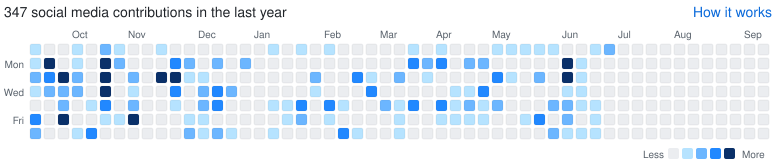

# Social Contributions Chart

A widget for the profile README that looks exactly like GitHub's **"contributions over
the last year"** heatmap — but it counts **social posts** instead of commits, using a
**blue** intensity gradient.



---

## How it works

GitHub renders its real contribution graph fresh on every request, but a README can only
embed a **static image**. So this widget is a committed `social-contributions.svg` that is
**regenerated on a schedule**. The generator always renders the *trailing 365 days ending
today*, so each run rolls the window forward exactly like GitHub's graph (which itself only
advances once per day).

```
Microsoft Scout (heartbeat)
        │  appends one line per detected post
        ▼
OneDrive: social-posts.jsonl   ◄── the status log
        │  WorkIQ reads it (scheduled app workflow)
        ▼
repo: social-contributions/data/social-posts.jsonl
        │  generate.py  (GitHub Action, several times a day)
        ▼
repo: social-contributions/social-contributions.svg  ──►  embedded in README.md
```

Two refresh drivers keep it current:

| Driver | What it does | Cadence |
| --- | --- | --- |
| **GitHub Action** (`.github/workflows/social-contributions.yml`) | Re-runs `generate.py` and commits the SVG if it changed. Rolls the trailing-year window even when no new posts arrive. | Every 6 h + on data change |
| **WorkIQ app workflow** ("Sync social posts from OneDrive") | Pulls the latest `social-posts.jsonl` from OneDrive into the repo, which triggers the Action to re-render. | Daily (enable after Scout is live) |

> **Want literally per-visit freshness?** Host `generate.py` behind a tiny serverless
> endpoint that returns the SVG per request and embed that URL instead. The scheduled
> approach above matches GitHub's day-granularity behavior without running a server.

---

## Data format (the OneDrive file)

**File:** `social-posts.jsonl` in OneDrive — **JSON Lines** (one JSON object per line).
JSON Lines is append-friendly, which suits a heartbeat that adds entries over time.

```jsonl
{"date": "2026-06-19", "platform": "linkedin", "type": "post",    "url": "https://www.linkedin.com/posts/...", "title": "Work IQ APIs are GA"}
{"date": "2026-06-19", "platform": "x",        "type": "tweet",   "url": "https://x.com/amandaksilver/status/123"}
{"date": "2026-06-18", "platform": "x",        "type": "retweet", "url": "https://x.com/amandaksilver/status/124"}
{"date": "2026-06-17", "platform": "blog",     "type": "post",    "url": "https://example.com/post", "title": "Shipping with customers"}
```

| Field | Required | Notes |
| --- | --- | --- |
| `date` | yes | `YYYY-MM-DD` (the post's local date). |
| `platform` | yes | `linkedin`, `x` (or `twitter`), `blog`, `medium`, `substack`, … |
| `type` | yes | `post`, `article`, `tweet`, `quote`, `retweet`, `repost`, `share`, … |
| `url` | recommended | Used to **de-duplicate** repeated heartbeat entries. |
| `title` | optional | Used in the tooltip; helps dedup when there's no URL. |

A plain JSON array or `{"posts": [...]}` document is also accepted.

---

## Scoring → blue gradient

Each post earns points by effort; the per-day total maps to a blue intensity level
(mimicking GitHub's 0–4 green scale).

| Points | What counts | Examples |
| --- | --- | --- |
| **3** | original long-form / professional | LinkedIn post or article, blog/Medium/Substack post |
| **2** | original short-form | original tweet / X post / quote tweet |
| **1** | amplification | retweet, repost, reshare, share |

| Daily score | Level | Light | Dark |
| --- | --- | --- | --- |
| 0 | L0 | `#ebedf0` | `#161b22` |
| 1–2 | L1 | `#b6e3ff` | `#0a3069` |
| 3–5 | L2 | `#6cb6ff` | `#1f6feb` |
| 6–9 | L3 | `#2188ff` | `#2f81f7` |
| 10+ | L4 | `#0a3069` | `#79c0ff` |

Weights and thresholds live at the top of `generate.py` (`weight_for`, `score_to_level`) —
tweak them to taste.

Every square also carries an **inline `fill`** (light palette); the embedded `<style>` only
*overrides* colors for dark mode. So clients that ignore SVG `<style>` (some mobile in-app
webviews / image proxies) still show the correct chart, and the image scales responsively
via its `viewBox` on small screens.

---

## Running it manually

```bash
python social-contributions/generate.py                 # data/social-posts.jsonl -> SVG
python social-contributions/generate.py --demo          # synthesize a year of sample data
python social-contributions/generate.py --asof 2026-06-20
```

No third-party dependencies — standard-library Python 3.9+.

---

## The Microsoft Scout prompt

Configure a Scout heartbeat with the prompt in [`SCOUT_PROMPT.md`](./SCOUT_PROMPT.md).
It tells Scout to detect new LinkedIn/blog/X activity and **append** matching lines to
`social-posts.jsonl` in OneDrive.
